# Fastcampus 상품 거래 1년 데이터 분석

# 프로젝트 개요
### 신규 강의 카테고리의 특징 및 수명주기 등을 파악해서 새로운 수요 창출을 하고자 함.

# 기술스택
   

# 프로젝트 진행단계
### 1. 문제 정의
### 2. 전처리
### 3. EDA

# 프로젝트 세부과정

  
<b>1. 문제 정의 및 전처리</b>

  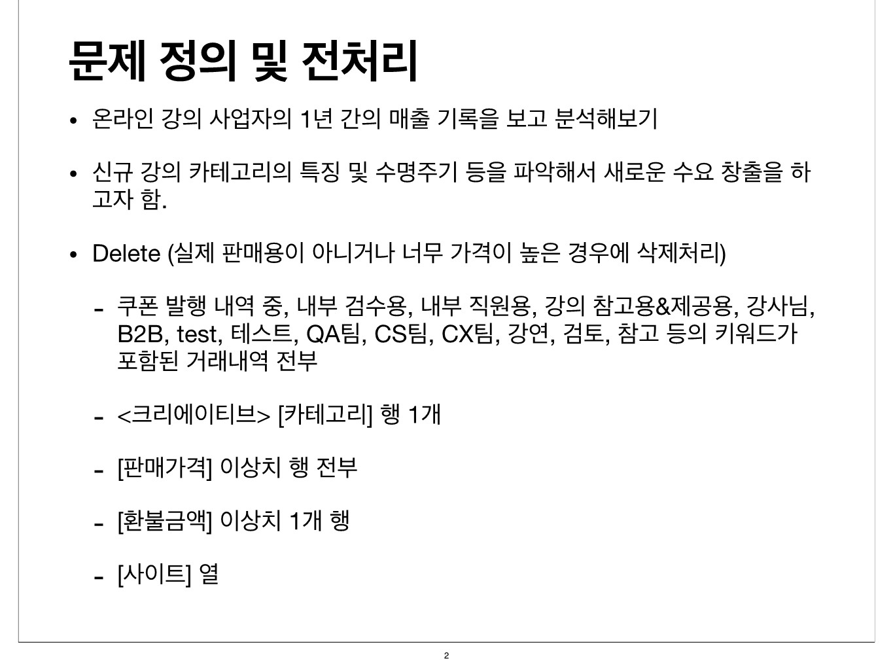
  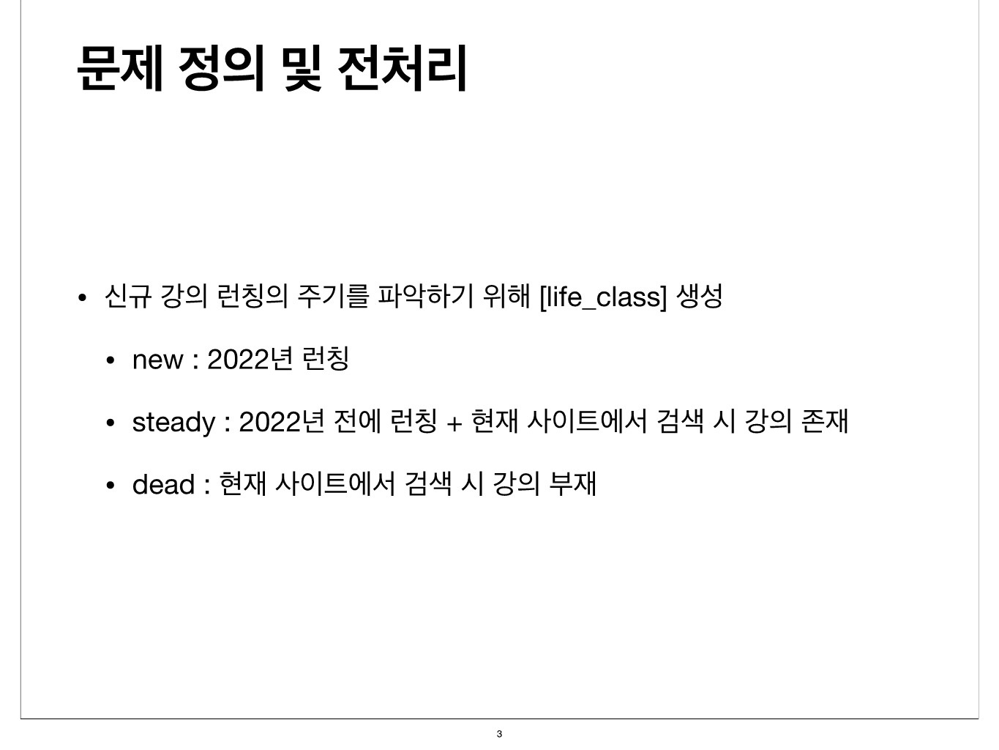
  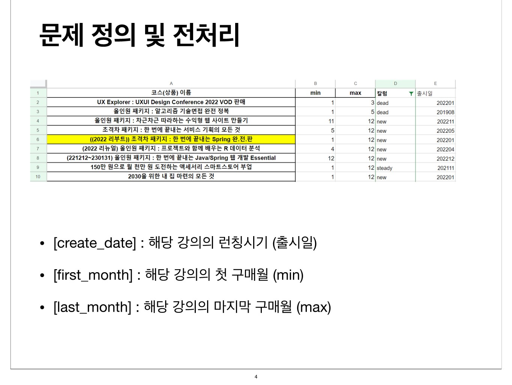

  
<b>2. EDA</b>

  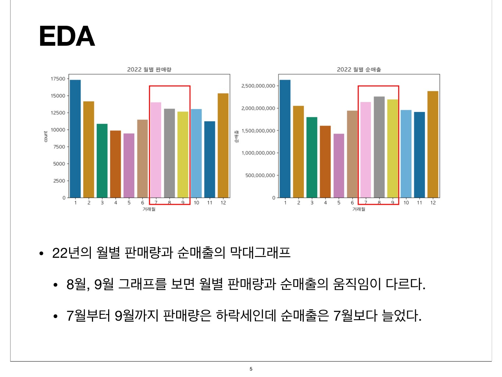
  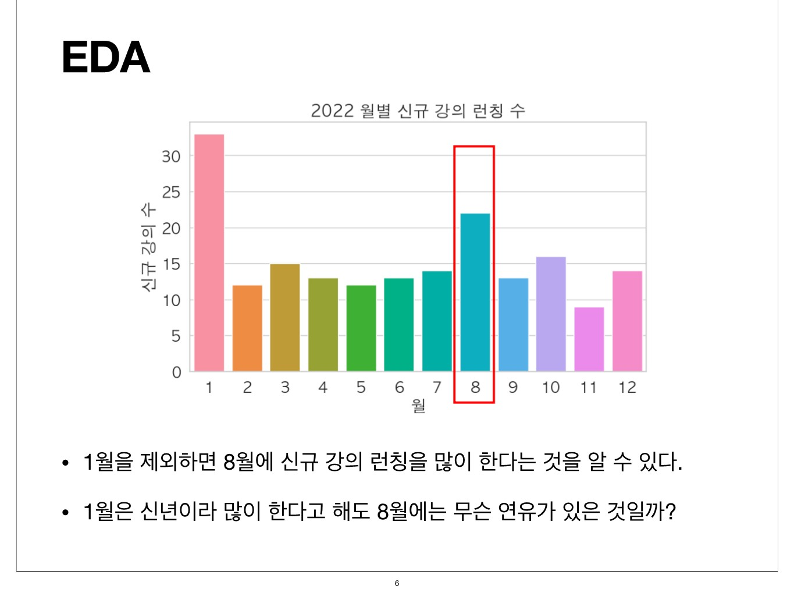
  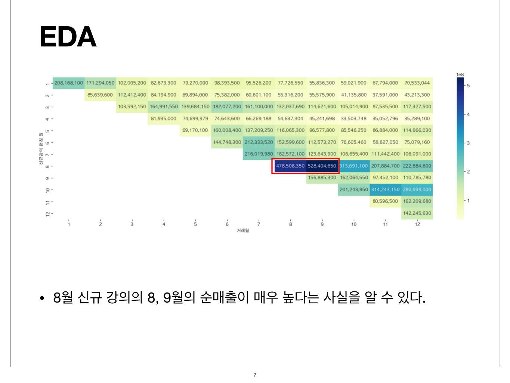
  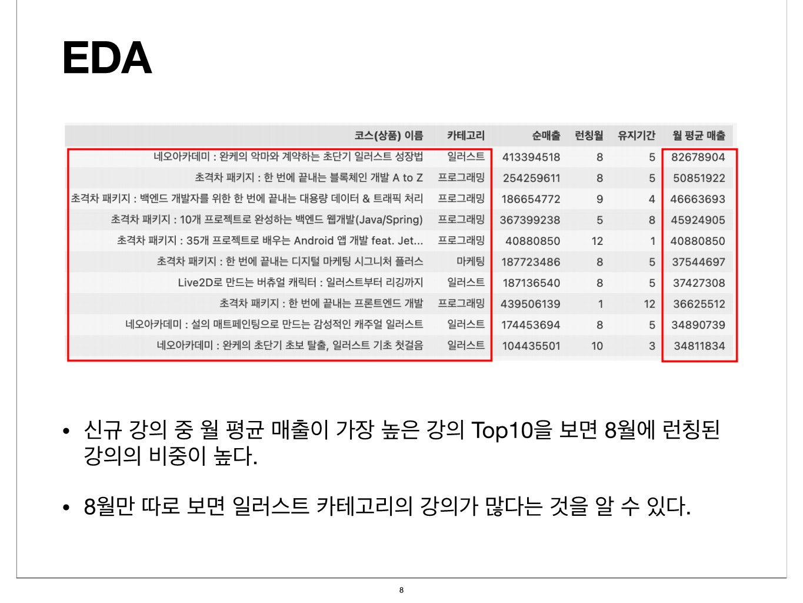
  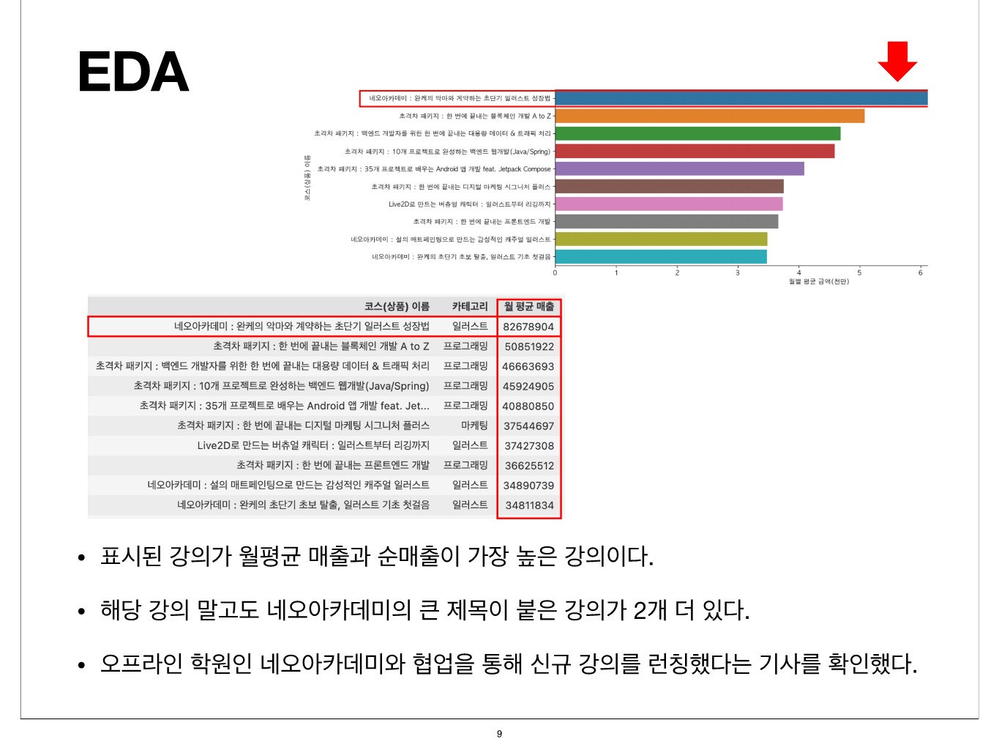
  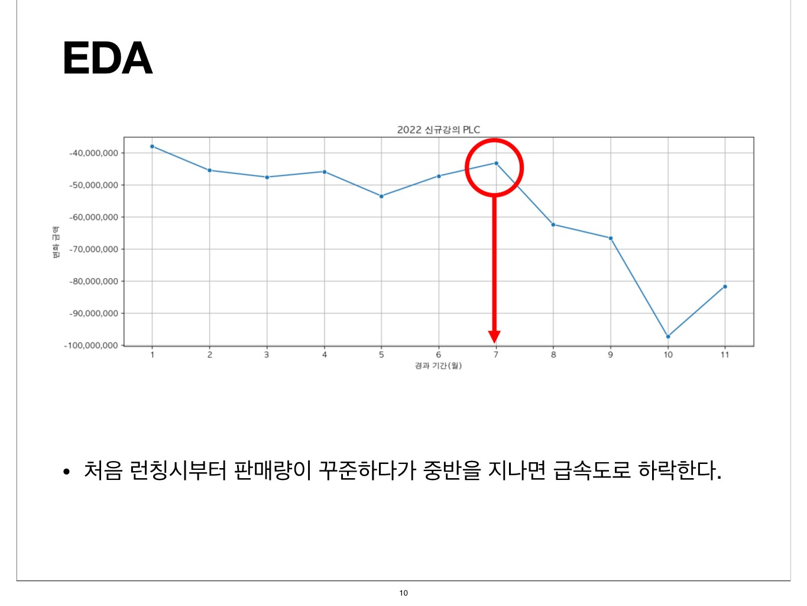
  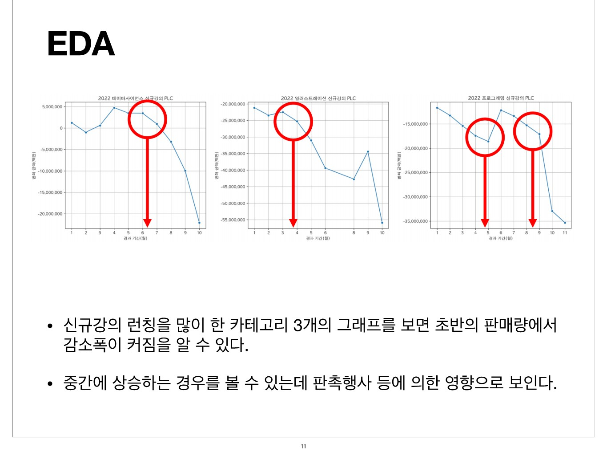

# 프로젝트 결과

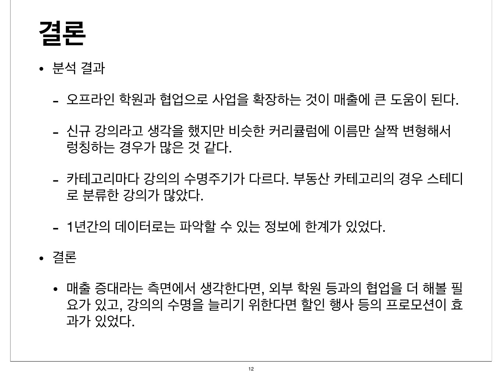

# 프로젝트 회고
